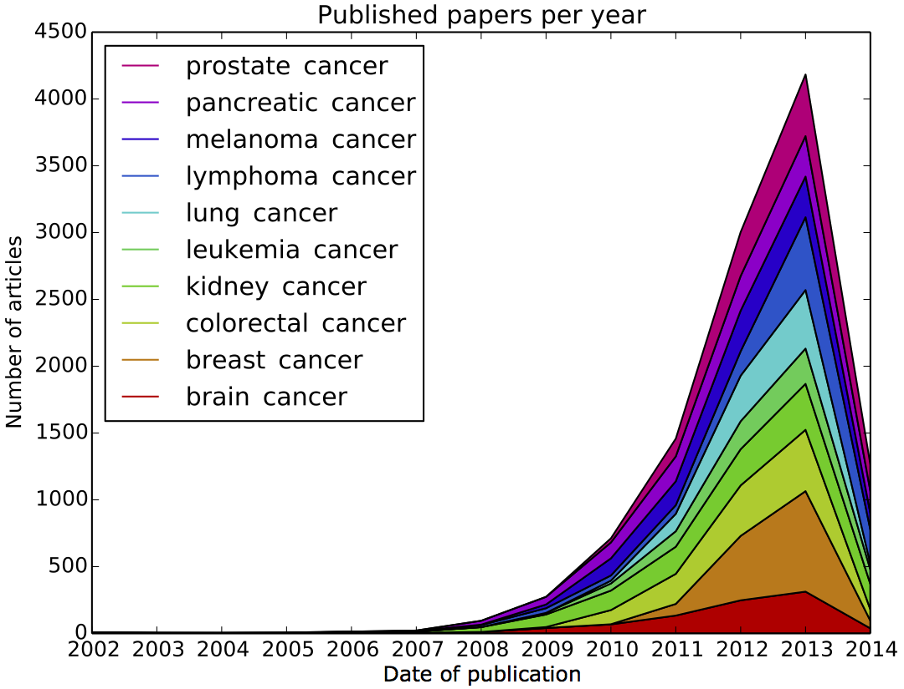

## READ ME

This repository contains a dataset consisting of 11049 full text cancer research papers meant for text categorization tasks. 

If you intend to use this dataset for your research, please consider citing it:

    @misc{franziska_horn_2018_1254443,
      author       = {Franziska Horn},
      title        = {cod3licious/cancer_papers},
      month        = may,
      year         = 2018,
      doi          = {10.5281/zenodo.1254443},
      url          = {https://doi.org/10.5281/zenodo.1254443}
    }

All articles are publicly available on PubMed Central and were downloaded from there in August 2014 by searching for different cancer types using the [PubMed API](http://www.ncbi.nlm.nih.gov/books/NBK25500/). Here is an overview of the number of papers per year downloaded for each keyword:

In a preprocessing step, the dataset was reduced to contain only articles (a) associated with a single cancer type and (b) reporting original research (i.e. no editorials of journals, etc.). The paragraphs of each article were automatically assigned one of the paragraph type labels 'Abstract', 'Introduction', 'Methods', 'Results', 'Discussion', or 'Mixed', depending on the respective heading identified in the downloaded XML file. 

The preprocessed raw texts of all articles sorted by keyword are in the folder `pmc_preproc`. The script `load_cancer.py` contains a single function `articles2dict` to load the texts and associated labels (either keyword, i.e. cancer type or paragraph type like 'Results' or 'Methods'). Refer to the script for further details on the function arguments as well as examples for loading the texts with different labels.

If you have any questions please don't hesitate to send me an [email](mailto:cod3licious@gmail.com) and of course if you should find any bugs or want to contribute other improvements, pull requests are very welcome!
